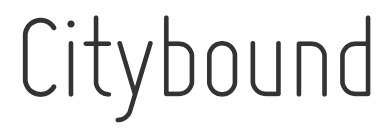

Citybound is a city building game with a focus on realism, collaborative planning and simulation of microscopic details. It is independently developed, open source and funded through Patreon.

* [Homepage](http://cityboundsim.com) (with screenshots and videos)
* [Latest Downloadable Game Builds](http://aeplay.org/citybound-livebuilds) (for Windows, Mac and Linux)
* [Living Design Doc](https://www.notion.so/aeplay/Citybound-Living-Design-Doc-3b42707cbca54d079d301d9190ac85bb) (includes detailed notes, plans, inspirations and references)
* [LICENSE](LICENSE.txt) (AGPL)
* [Contributing & Development](CONTRIBUTING.md) (includes instructions for the custom build process)
